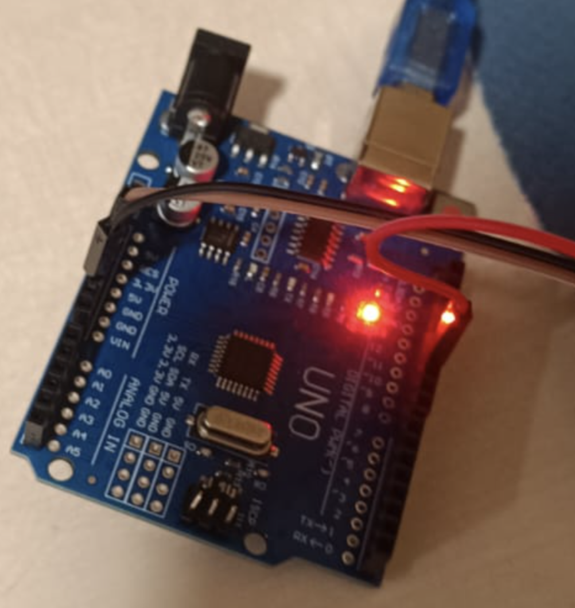
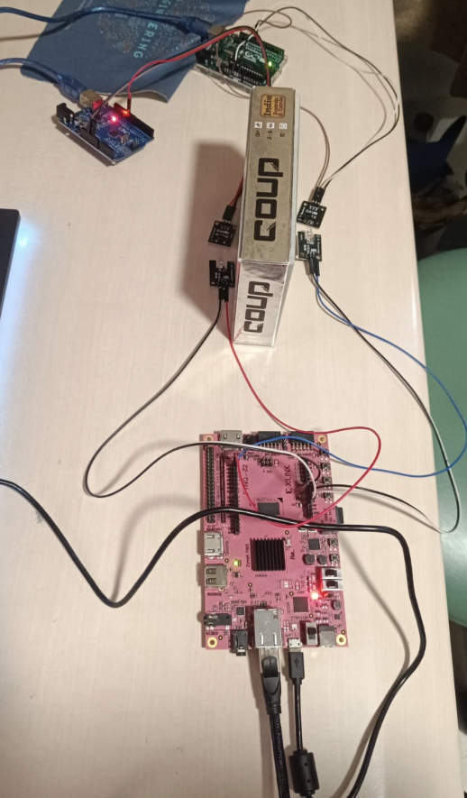
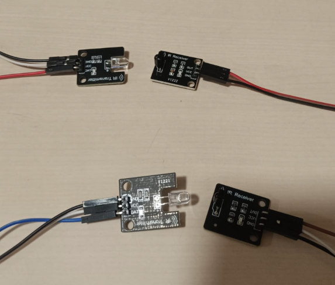
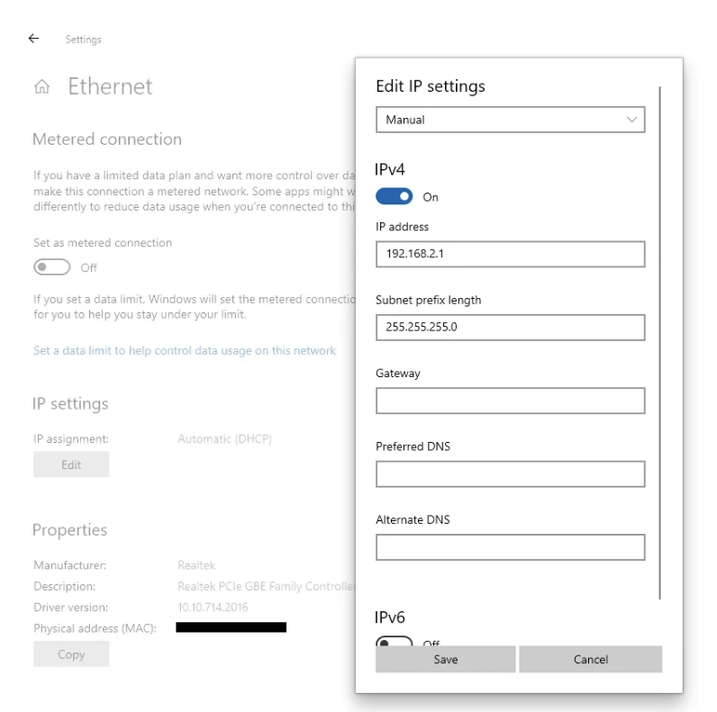

# OWN Standard IR Communication Protocol

> A custom IR communication protocol inspired by NEC, featuring parallel dual-channel transmission using a PYNQ-Z2 FPGA and dual Arduino Uno receivers.

---

## 📋 Table of Contents

- [Overview](#-overview)
- [Hardware Setup](#-hardware-setup)
- [Software Setup](#-software-setup)
- [Running the Project](#-running-the-project)
- [Protocol Specification](#-protocol-specification)
- [Modifying the PL Design](#-modifying-the-pl-design)
- [Troubleshooting](#-troubleshooting)

---

## 🔍 Overview

This project implements a custom IR communication standard across two components:

| Component | Role |
|-----------|------|
| **PYNQ-Z2 FPGA** (PS + PL) | IR Transmitter — sends signals via AR0 and AR1 pins in parallel |
| **Arduino Uno × 2** | IR Receivers — decode and display received signals over Serial |

---

## 🛠 Hardware Setup

### Components Required

- PYNQ-Z2 FPGA board × 1
- Arduino Uno × 2
- IR transmitter × 2 (connected to FPGA)
- IR receiver × 2 (one per Arduino)
- Jumper wires

> ⚠️ **Important:** Place a physical barrier between the two IR transmitters to prevent signal interference.

---

### 🔌 Wiring Connections

#### FPGA → IR Transmitter 1

| IR Transmitter 1 | PYNQ-Z2 Pin |
|------------------|-------------|
| Data             | AR0         |
| VCC              | VCC         |
| GND              | GND         |

#### FPGA → IR Transmitter 2

| IR Transmitter 2 | PYNQ-Z2 Pin |
|------------------|-------------|
| Data             | AR1         |
| VCC              | VCC         |
| GND              | GND         |

#### Arduino 1 (Blue) → IR Receiver 1

| IR Receiver 1 | Arduino Pin |
|---------------|-------------|
| Data          | Pin 11      |
| VCC           | 5V          |
| GND           | GND         |

#### Arduino 2 (Green) → IR Receiver 2

| IR Receiver 2 | Arduino Pin |
|---------------|-------------|
| Data          | Pin 11      |
| VCC           | 5V          |
| GND           | GND         |

---

### 📷 Hardware Photos

<details>
<summary>Click to expand wiring photos</summary>

**FPGA + Transmitters:**


**Arduino 1 (Blue) + Receiver:**


**Arduino 2 (Green) + Receiver:**


**Full System Connections:**


**Transmitter Barrier (interference prevention):**


</details>

---

## 💻 Software Setup

### Project Structure

```
Own_IR_Standard/
├── PS part/
│   └── nec_onlyFPGA.ipynb          # Jupyter notebook for PYNQ-Z2
├── PL part/                         # Vivado hardware design files
├── arduino part/
│   └── IR_TransmitterReceiver/
│       └── IR_TransmitterReceiver.ino
└── xilinx/overlays/own/
    ├── design_1_wrapper.bit         # FPGA bitstream
    └── design_1_wrapper.hwh         # Hardware handoff file
```

### Required Libraries

- **Arduino:** [Arduino-IRremote](https://github.com/Arduino-IRremote/Arduino-IRremote)

---

### Step-by-Step Installation

#### 1. Connect the PYNQ-Z2 Board

Connect the PYNQ-Z2 to your computer using:
- Micro-USB cable (power/programming)
- Ethernet cable (network access)

For first-time setup, configure the IP address by following:
- 📺 [Video Guide](https://www.youtube.com/watch?v=mZ8zO3Yy-Fg)
- 📄 [Written Tutorial](http://blog.umer-farooq.com/a-pynq-z2-guide-for-absolute-dummies-part-i-fun-with-leds-and-switches-47dd76abf9a9)



#### 2. Access the PYNQ-Z2 Jupyter Server

Open your browser and navigate to:

```
http://192.168.2.99:9090/
```

> 🔑 Default password: `xilinx`

#### 3. Upload Project Files to the Server

| File | Destination on Server |
|------|-----------------------|
| `nec_onlyFPGA.ipynb` | Your project folder |
| `design_1_wrapper.bit` | `xilinx/overlays/own/` |
| `design_1_wrapper.hwh` | `xilinx/overlays/own/` |

#### 4. Upload the Arduino Sketch

1. Open `IR_TransmitterReceiver.ino` in the Arduino IDE
2. Upload the sketch to **both** Arduino boards

---

## 🚀 Running the Project

1. Open `nec_onlyFPGA.ipynb` on the PYNQ-Z2 Jupyter server
2. Modify `cmd0_str` and `cmd1_str` variables to set the messages you want to transmit
3. Run all cells in the notebook

**What happens:**
- The FPGA transmits IR signals **simultaneously** via AR0 (Transmitter 1) and AR1 (Transmitter 2)
- Each Arduino receives its respective IR signal on Pin 11
- Decoded values are printed in each Arduino's **Serial Monitor** at baud rate `9600`

---

## 📡 Protocol Specification

This protocol is custom-designed and inspired by the NEC IR standard, with the following differences:

| Feature | NEC Standard | OWN Standard |
|---------|-------------|--------------|
| Total bits | 32 bits | 10 bits |
| Address bits | 8 bits | 5 bits |
| Command bits | 8 bits | 5 bits |
| Parallel channels | 2 | 2 (concurrent) ✨ |

> 🚧 Parallel own transmission (dual-channel) is currently still in progress.

---

## 🔧 Modifying the PL Design

To modify the hardware design in Vivado:

### 1. Install Required Tools

- **Vivado 2020.2** — [Download from Xilinx Archive](https://www.xilinx.com/support/download/index.html/content/xilinx/en/downloadNav/vivado-design-tools/archive.html)
- **PYNQ-Z2 Board Files** — [Install from this repository](https://github.com/xupsh/pynq-supported-board-file?tab=readme-ov-file)

### 2. Project Folder Responsibilities

| Folder | Description |
|--------|-------------|
| `PS part/` | PYNQ-Z2 server-side code (Processing System) |
| `PL part/` | IP cores and hardware design (Programmable Logic) |
| `arduino part/` | Arduino code for testing and debugging |

---

## 🐛 Troubleshooting

| Symptom | Possible Cause | Solution |
|---------|---------------|----------|
| No IR signal received | Receiver not powered | Check that the LED on the IR receiver is lit |
| Garbled / corrupted data | Baud rate mismatch | Ensure both ends use baud rate `9600` |
| FPGA not responding | Board still booting | Wait 1–2 minutes after powering on |
| Arduino not detected | Connection issue | Check USB cables and verify the correct COM port is selected |
| Signal interference between channels | No barrier between transmitters | Place a physical divider between the two IR transmitters |
